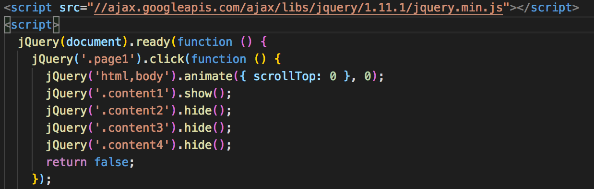
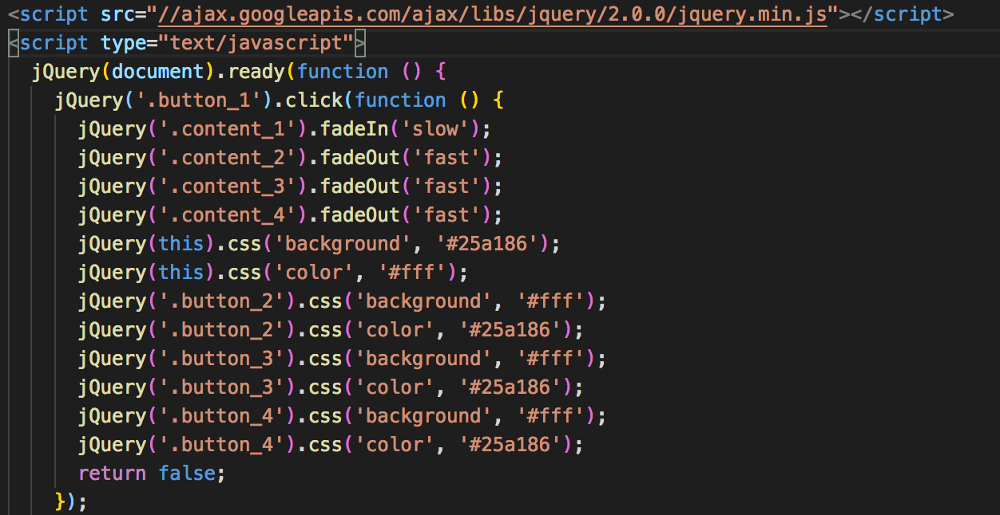
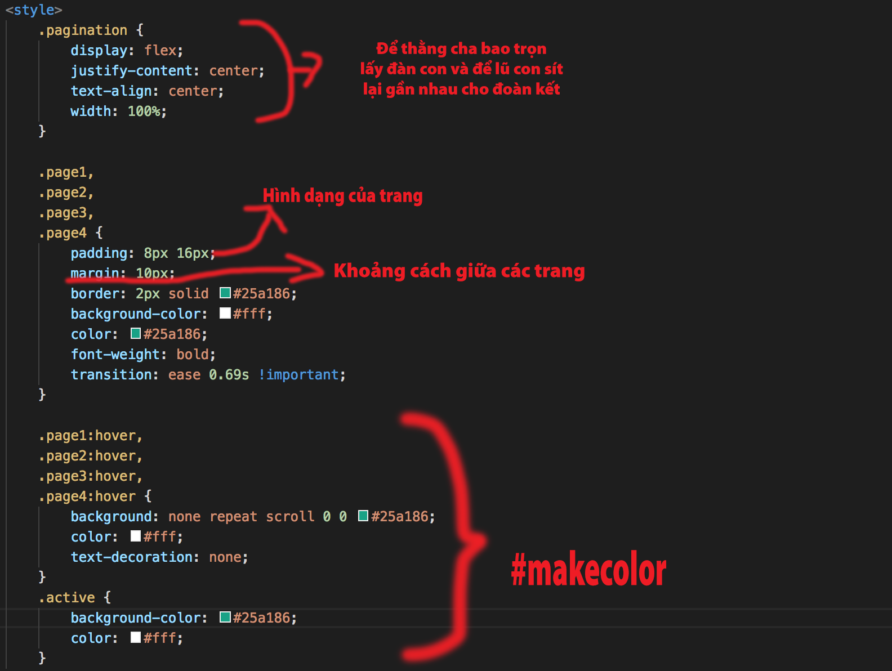
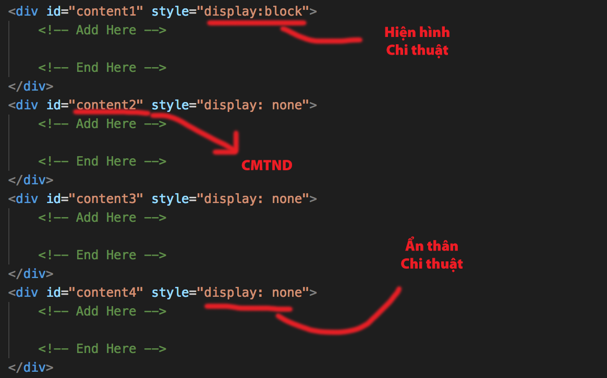
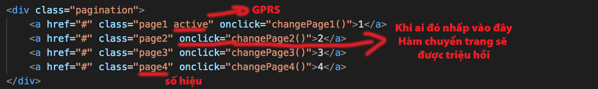
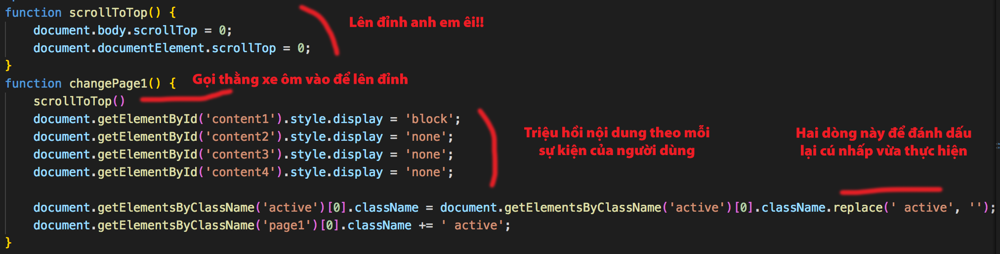
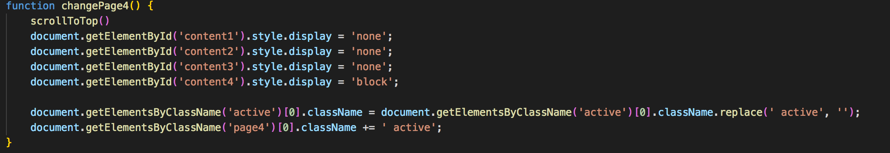

# Cách phân trang trong bài viết trên Blogger

## LỜI NÓI ĐẦU

Chắc hẳn với những ai hay viết blog, hay dịch truyện chữ thì Wordpress là một trong những trang ổn định nhất, nó có hầu như mọi thứ, người dùng chỉ cần cài đặt thêm vài plugin để thoả mãn yêu cầu của bản thân. Tuy nhiên, nội dung của WP (Wordpress) lại quá 'eo hẹp', nó không cho phép người dùng được đăng tải những nội dung 'e hèm' một chút. Ngược lại với nó thì Blogger (của Google) hay Tumblr (của Yahoo) dù không ủng hộ nhưng không cấm những người dùng của mình đăng những content hơi bị 'á hự' một chút. Vì những lí do trên, mình quyết định sử dụng Blogger để đăng tải những nội dung mình làm.

Trước khi đi vào nội dung chính của bài viết này, mình muốn nhắc để các bạn (những người dự định phát triển nội dung trên nền tảng blogspot) cân nhắc thật kĩ về việc PHÂN TRANG TRONG BÀI VIẾT.

Thứ nhất, việc phân trang sẽ làm tốc độ load bài viết bị giảm đáng kể. Vì thay vì người xem (viewer) chỉ cần load trang 1 lần thì họ sẽ phải load bằng số trang mà bạn phân ra.

Thứ hai, việc này ảnh hưởng rất lớn đến việc SEO, do sự 'thoắt ẩn thoắt hiện' của bài viết được phân trang. Nên có thể làm ảnh hưởng tới doanh số của bạn.

Còn bây giờ thì chuyển sang việc phân trang nào!

## ĐẶT VẤN ĐỀ

Bên Wordpress, việc này dễ hơn hẳn, người dùng chỉ việc cài thêm một plugin, và thế là mọi chuyện đã xong. Nhưng ở Blogger thì khác, bạn sẽ phải làm tất cả mọi việc bằng tay. Tức là mọi thứ từ việc các trang nhỏ xíu ở dưới trông như thế nào, nó hoạt động ra sao, bạn đều phải làm hết.

Thật mừng là anh Google có kha khá nhiều bài viết xoay quanh vấn đề này dù vài bài có hơi lan man (mình có một tật xấu là bất cứ việc gì chưa biết thì hỏi anh Gúc trước, có lẽ mình nên hạn chế thói quen xấu này lại), và mình đã tìm được 2 trang sau, cũng tạm ổn để giải quyết vấn đề trước mắt

//Insert link 2 trang

Cả 2 trang đều dạy mọi người sử dụng JQuery - một thư viện của Javascript - cho phép phân trang ngay tức thì, cấu trúc thuật toán cũng rất dễ hiểu, dễ đọc, dễ Ctrl+C và Ctrl+V.





Những phần lặt vặt mình sẽ không nói đến vì với trình độ tiếng Anh cơ bản cũng có thể đọc hiểu là phải chèn nội dung vào đâu rồi, mình sẽ chỉ nhắc tới hai điểm nổi bật như trong hình trên.

Thanh niên bên trên chỉ dùng hàm `.show()` và `.hide()` để kiểm soát, khi bấm vào một số trang nào đó, nó sẽ show ra nội dung của thằng tương ứng. Nhược điểm của gã này là dùng thẻ `<span>` thành ra các link trông rất sít nhau, khó bấm. Gã này có dạy thêm ở trang 3 và trang 4 trong blog của hắn về cách để tạo ra cái đường link sang page sau ấy, nhưng mình thấy nó vẫn bất tiện dã man nên skip luôn.

Thanh niên bên dưới thì đẹp đẽ sạch sẽ hơn, dùng hàm `.fadeIn()` và `.fadeOut()`, cách làm tương tự thanh niên bên trái, nhưng các thứ các thứ di chuyển mượt mà hơn. Tuy nhiên có một điểm không ổn lắm, đấy là nó sẽ không trở về đầu trang nếu mọi người đột nhiên muốn quay lại đọc từ đầu.

Vậy thì, sao ta không kết hợp hai gã lại với nhau nhỉ? Kéo style của gã bên phải đắp sang gã bên trái, đổi thẻ `<span>` thành thẻ `<div>`. Mình đã làm y hệt, và kết quả thì cũng tạm ổn, nhưng mình thấy chưa được ưng ý cho lắm bởi vì:

* Khi dùng đến thư viện JQuery, thường mọi người sẽ phải gọi nó về và gắn trong thẻ `<script>`, đặt trước mọi thẻ `<script>` khác nếu muốn các thiết lập của mình chạy được. Chẳng hạn: `<script src="//ajax.googleapis.com/ajax/libs/jquery/2.0.0/jquery.min.js"></script>`
* Mọi người hẳn nghĩ là mình chỉ dùng hai hàm của nó thì nó cũng sẽ chỉ trích ra hai hàm trong đống trên và đưa về cho mình dùng nhỉ? Nhưng không, nó sẽ lấy tất tần tật về, và nếu hai hàm mình gọi ra có trong nó thì nó sẽ cho phép mình dùng chúng. Vậy tức là trang web của bạn sẽ thực hiện như sau:
  - Tải trang
  - Đến bài viết
  - Tải bài viết 
  - Thấy lời gọi thư viện 
  - Gọi đến địa chỉ CDN 
  - Kéo thư viện về 
  - Gắn vào các thứ 
  - Tải nốt phần còn lại

Vậy là bạn mất đến 6 bước để làm việc đó, và như vậy thì người dùng sẽ tốn công tải trang hơn, CPU tốn nhiều hơn, với người dùng điện thoại thì sẽ tốn dữ liệu di động hơn. Chung quy như vậy theo mình là không ổn lắm. Chưa kể nếu bài viết của bạn lớn thì nhiều khả năng người dùng sẽ nghi ngại rằng cái trang củ lìn này đang gắn mã độc để đào bitcoin, và pùm, pạn mất đi một người dùng thân thiện :'(

Như mình đã nói ở trên, JQuery chỉ là một thư viện của Javascript, giúp việc đọc hiểu dễ dàng hơn, nhưng ngược lại thì tốn tài nguyên hơn hẳn Javascript thuần tuý. Vậy sao ta không tự xây dựng chúng bằng chính JS  nhỉ?

## CÁC BƯỚC XÂY DỰNG

Bạn phải chuyển sang thẻ HTML trong giao diện thêm mới bài viết đế thực hiện việc này.

Đầu tiên ta cần phải suy nghĩ việc đặt các khối, như mình từng đọc thì việc đặt script ở cuối trang sẽ làm tăng hiệu suất xử lý. Tưởng tượng thằng trình duyệt là một con giun đất, ăn được tí nào thì ỉa ra tí ấy, vậy thì, nếu nó ăn các thẻ HTML thì nó sẽ ỉa nhanh hơn là nhai nhầm phải cục đá (JS).

Vậy thì mình sẽ đặt các thẻ như sau:

```
<style>
<nội dung>
<phân trang>
<script>
```

Về Style thì các bạn có thể tham khảo trên W3School nhé, mình sẽ đặt như thế này cho hợp màu chung của Blog



Sau đó thì tới nội dung, với mỗi nội dung thì bạn đưa vào một thẻ div nhé, và thêm cho nó một cái id như kiểu CMTND ấy, và một cái style, mặc định sẽ tải nội dung đầu tiên nên mình gắn luôn cho thằng đầu tiên là 'block', những cu sau thì để là 'none'. Bạn sẽ được như sau:



Cứ thế đến vùng nội dung mà bạn cần chia. Lưu ý là các dòng trong `<!-- -->` là các comment, nó không ảnh hưởng gì tới bài post cả, nó chỉ là một cái ngăn cách để đánh dấu chỗ cần chèn nội dung thôi.

Tiếp đến là việc phân trang, ở đây mình gắn thẳng sự kiện vào luôn các đường thẻ. Ở đây ta dùng `class` để đặt số hiệu cho chúng nó nhé, và một class to đùng gọi là `pagination` để bao bọc tất cả bọn kia. Và thêm một thằng `active` nữa để đánh dấu cái trang mà mình đang chọn



Cuối cùng thì đặt lệnh vào thôi.



Tại đây, mình muốn mỗi lần bấm vào thì người xem quay về đầu trang, hiển thị nội dung của trang được chọn, và thay đổi đánh dấu trang hiện tại. Cứ thế đến hàm xử lý sự kiện tiếp theo mà ta đã gắn trong phần 'onclick' phía trên. Cứ thế, đảo vị trí cho nhau đến khi kết thúc



**Lưu ý:** Bạn hoàn toàn có thể chia nhiều hơn 4 trang, nhưng mình khuyên là không nên làm quá nhiều trang. Tầm 4 5 trang đổ về là được. Đơn giản là vì càng nhiều trang thì việc tải càng lâu, không còn hiệu quả cho việc bạn muốn nhắm tới nữa.

## TỔNG KẾT

Ta đã làm được phân trang bằng JS thuần cho bài viết trên Blogger.

Tuy nhiên, cách làm của mình vẫn còn nhiều hạn chế, nếu được các bạn hãy tìm cách làm nó tốt hơn và dạy mình cách cải thiện nó nhé.

* Link project trên github: Github.
* Link demo việc phân trang: [Demo](https://bluevvmoon.blogspot.com/2018/08/miikkaaxx-veni-vidi-vici.html).

Bài viết này chính mình cũng cảm thấy còn nhiều bất cập. Các bạn giúp mình bổ sung chỗ thiếu sót ngu si của bản thân nhé :>

@greenvvmoon